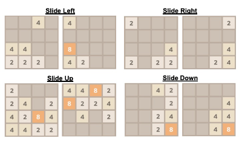
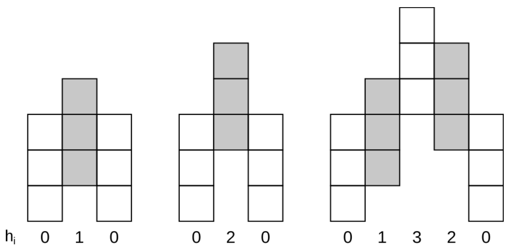
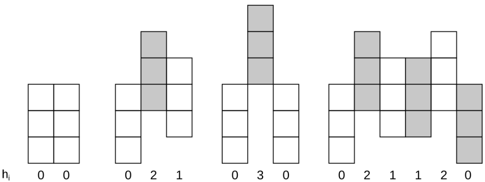
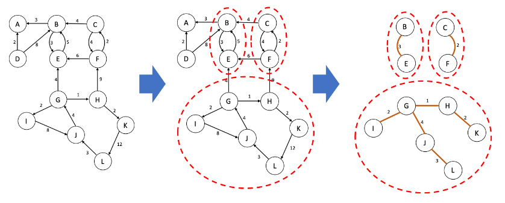

# Algorithmic Strategies Assignments

___

## Used Technologies :computer:

  

___

##    2048 Game
###    Goal :dart:

Identify the minimum number of plays that merge all tiles into one. A maximum number of plays allowed is provided. If it is not possible to clear the board with that number of plays, you must report no solution.

##    ARChitecture
###    Goal :dart:

Compute the number of distinct arcs that can be built for the given values n, h and H. Since this number can be very
large, you need to report your answer in modulo 1000000007.

- Valid arcs.
 

- Not valid arcs.

##    Bike Lanes
###    Goals :dart:

1. How many circuits exist in the city?
2. How many POIs does the largest circuit contain?
3. What is the longest lane to build (considering a different lane for each circuit)?
4. What is the total length of bike lane to build (considering all circuits)?

___

## **Contributors** :sparkles:

<html><i><b> Licenciatura Engenharia Informática - Universidade de Coimbra 
Estratégias Algoritmícas - 2020/2021  
Coimbra, 16 de maio de 2021
</b></i></html>

:mortar_board: *[Rodrigo Sobral](https://github.com/RodrigoSobral2000)*
:mortar_board: *[Eduardo Cruz](https://github.com/eduardoffcruz)*

___

## License :link:
Have a look at the [license file](LICENSE) for details
___
